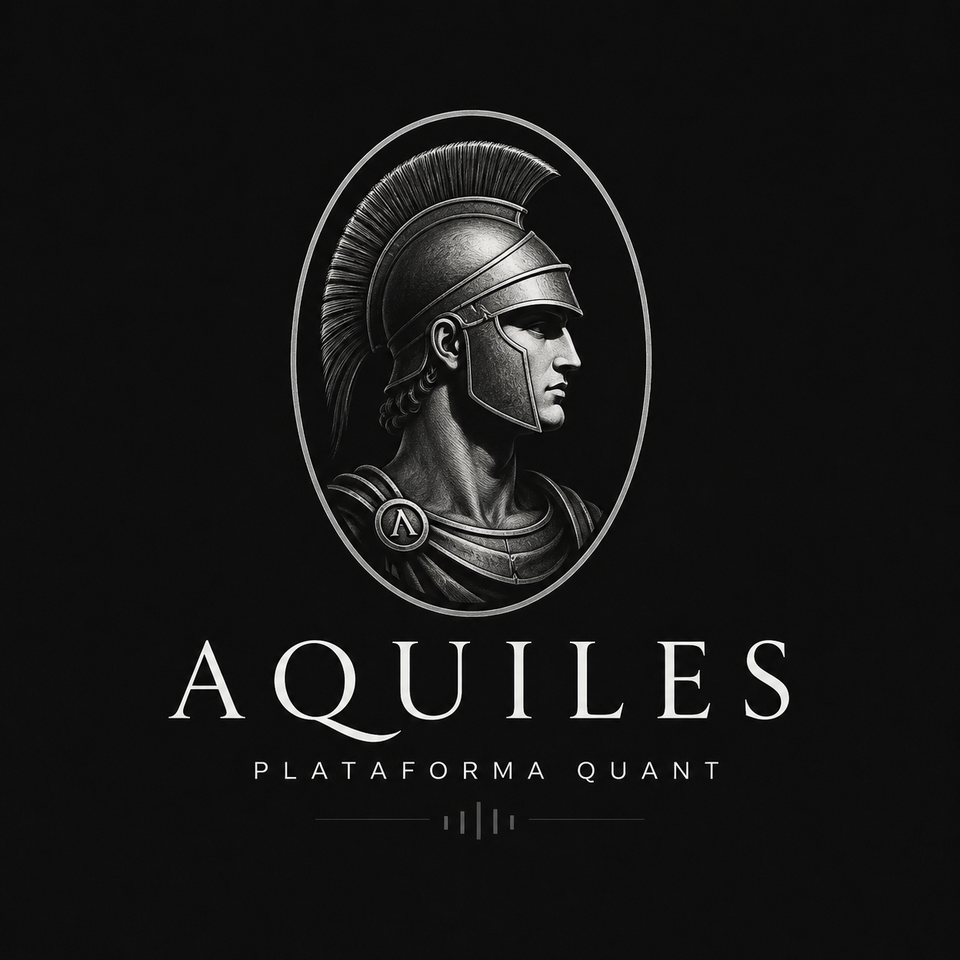
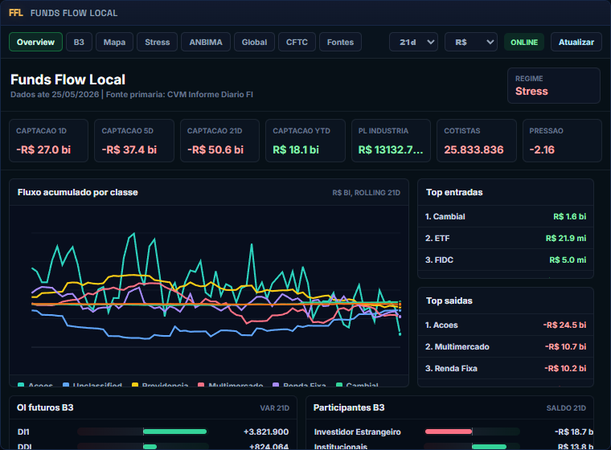
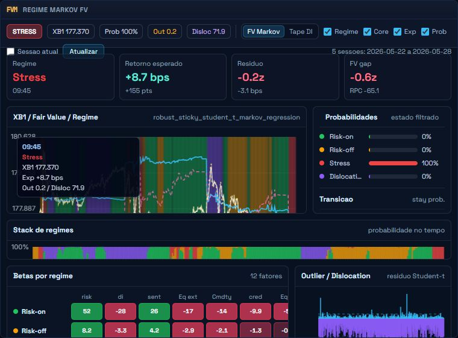
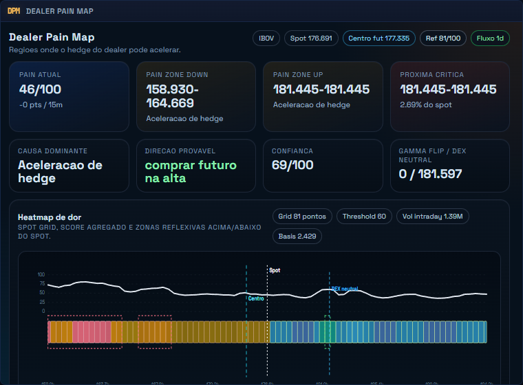
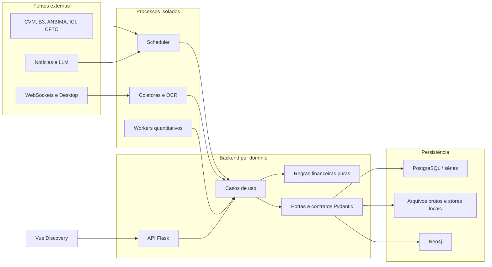

<p align="center">
  
</p>

<h1 align="center">Aquiles | Inteligência Quantitativa de Mercado</h1>

<p align="center">
  Plataforma local para opções, fluxo de fundos e participantes, dados regulatórios,
  macro, fair value, regimes de mercado, notícias e simulação multiagente.
</p>

<p align="center">
  <a href="https://github.com/guitartarotti/Aquiles/actions/workflows/ci.yml"></a>
  
  
  
  
</p>

O Aquiles transforma fontes heterogêneas, com cadências e contratos diferentes, em
produtos financeiros auditáveis. O sistema combina captura em tempo real, pipelines
regulatórios, modelos quantitativos determinísticos, classificação assistida por LLM,
persistência histórica e uma interface operacional orientada a investigação.

> O repositório não distribui credenciais nem bases operacionais. Integrações licenciadas
> exigem contas próprias e devem ser usadas somente com autorização.

## Visão rápida para avaliação

| Evidência verificável | Estado atual |
| --- | ---: |
| Contextos de negócio explícitos | 8 |
| Processos isolados e orquestrados por PM2 | 17 |
| Testes backend | 220 |
| Testes frontend unitários e de componentes | 34 |
| Jornadas E2E em Chromium | 6 |
| Arquivos Python sob mypy estrito | 137 |
| Cobertura mínima das regras financeiras puras | 80% |
| Cobertura mínima de autenticação | 90% |

Para uma análise estruturada, comece pelo
[guia de avaliação técnica](docs/evaluation-guide.md). Ele oferece uma trilha de 15
minutos por arquitetura, engenharia de dados, domínio financeiro, Clean Code,
segurança e testes, sempre com links para a implementação.

## Complexidade financeira

| Domínio | Problema tratado | Fontes e técnicas |
| --- | --- | --- |
| **Options intelligence** | superfície, gregas, open interest, pressão de hedge, pain map e regimes | B3, OpLab, Bloomberg Desktop, modelagem de volatilidade e dependência |
| **Funds Flow** | captação, resgate, patrimônio, exaustão de carteiras e pressão por classe | CVM Informe Diário/CDA, ANBIMA, B3, ICI e CFTC |
| **Participant Flow** | posição e atividade de estrangeiros, institucionais e demais participantes | WebSocket em tempo real, OCR W32 e histórico intradiário |
| **Macro e cross-asset** | transmissão entre juros, câmbio, índices, commodities e crédito | séries temporais, correlação, beta dinâmico e contexto de mercado |
| **Fair value e regimes** | valor justo, resíduos, dislocações e transições de estado | regressões robustas, Markov, modelos de qualidade e invariantes financeiros |
| **Regulatório e grafo** | composição, relacionamentos e mudanças em carteiras | CVM CDA, N-PORT, Neo4j e projeções determinísticas |
| **News intelligence** | ingestão, relevância e contexto para sinais | WebSocket, taxonomia determinística e LLM compatível com OpenAI |
| **Simulações** | cenários e comportamento multiagente | agentes, memória em grafo e geração de relatórios |

O desafio central não é apenas calcular indicadores. Cada fonte possui calendário,
atraso de publicação, granularidade, unidade, janela histórica e regra de retomada
próprios. O pipeline preserva data de referência, linhagem, status da origem e versão
do contrato para evitar misturar disponibilidade operacional com data econômica.

## Produto

<table>
  <tr>
    <td width="33%"></td>
    <td width="33%"></td>
    <td width="33%"></td>
  </tr>
  <tr>
    <td align="center"><strong>Funds Flow Local</strong></td>
    <td align="center"><strong>Fair Value e Markov</strong></td>
    <td align="center"><strong>Dealer Pain Map</strong></td>
  </tr>
</table>

Os widgets são ferramentas operacionais, não páginas demonstrativas. Eles oferecem
seleção de janela, estado das fontes, atualização, drill-down, séries históricas e
visões complementares para investigar o mesmo fenômeno financeiro.

## Arquitetura



Decisões importantes:

- a API atende consultas e comandos, mas não inicia loops de coleta;
- o scheduler é o único proprietário dos coletores agendados;
- dependências são montadas por aplicação e podem ser substituídas em testes;
- domínio não importa Flask nem infraestrutura;
- fontes externas entram por portas tipadas e adaptadores substituíveis;
- snapshots financeiros usam contratos versionados antes de persistência ou resposta;
- o frontend organiza recursos complexos por feature e proíbe HTTP direto em componentes.

Veja a [arquitetura completa](docs/architecture.md), o
[catálogo de domínios](backend/app/domains/catalog.py), o
[contêiner de dependências](backend/app/container.py) e os
[ADRs](docs/adr/README.md).

## Um dado do início ao fim

O Funds Flow é a implementação de referência da arquitetura interna:

1. `source_ports.py` define o que CVM, ANBIMA, B3 e ICI devem entregar;
2. os adaptadores `*_source.py` encapsulam download, cache, parsing e falhas;
3. contratos Pydantic validam comandos, status e snapshots versionados;
4. casos de uso coordenam fontes e repositórios sem conhecer Flask;
5. regras financeiras puras calculam janelas, captação, resgate e normalizações;
6. repositórios JSON ou PostgreSQL persistem o mesmo contrato;
7. a API serializa o resultado e a feature Vue monta as visões operacionais.

Código para acompanhar esse fluxo:

- [portas das fontes](backend/app/domains/funds_flow/application/source_ports.py)
- [contratos de entrada e saída](backend/app/domains/funds_flow/contracts/models.py)
- [regras financeiras](backend/app/domains/funds_flow/domain/rules.py)
- [adaptadores](backend/app/domains/funds_flow/infrastructure)
- [casos de uso](backend/app/domains/funds_flow/application/use_cases.py)
- [feature frontend](frontend/src/features/funds-flow)
- [testes de propriedade](backend/tests/test_financial_math_properties.py)
- [testes de contratos externos](backend/tests/test_funds_flow_external_contracts.py)

## Qualidade verificável

```powershell
npm run check
```

Esse único comando executa orçamento arquitetural, Ruff, ESLint, mypy estrito,
TypeScript, 254 testes backend/frontend e o build de produção. O GitHub Actions
adiciona as seis jornadas E2E em Chromium e gates independentes de cobertura:

| Gate | Piso bloqueante |
| --- | ---: |
| Backend global, incluindo legado | 31% |
| Funds Flow crítico | 60% |
| Cálculos financeiros puros | 80% |
| Autenticação e autorização | 90% |

O [quality budget](quality-budget.toml) também impede novos módulos gigantes, aumento
de supressões, ciclos não aprovados, domínio acessando infraestrutura, chamadas HTTP
em componentes e recriação de fachadas obsoletas. Detalhes estão em
[docs/quality-budget.md](docs/quality-budget.md) e
[docs/testing.md](docs/testing.md).

## Execução local

### Requisitos

- Windows 10/11 para OCR W32, Bloomberg Desktop e automação Excel;
- Python 3.11 e `uv`;
- Node.js 22.12 ou 24;
- Java 17 e Neo4j 5 quando o backend de grafo estiver habilitado;
- credenciais próprias apenas para os provedores escolhidos.

O núcleo web também funciona em Linux. As integrações Desktop são isoladas e
permanecem específicas do Windows.

### Instalação

```powershell
Copy-Item .env.example .env
npm run setup:all
backend\.venv\Scripts\python.exe -m playwright install chromium
```

Para subir o conjunto gerenciado:

```powershell
npm run services:start
npm run services:status
```

Para executar apenas API e frontend em desenvolvimento:

```powershell
npm run dev
```

O inventário executável dos 17 processos, portas, políticas de reinício e ownership
está em [ecosystem.config.js](ecosystem.config.js).

## Segurança

- `.env`, bancos, logs, caches, dados brutos e credenciais são ignorados pelo Git;
- autenticação usa tokens assinados e papéis `viewer`, `operator` e `admin`;
- operações destrutivas exigem privilégio administrativo;
- somente health check e login são públicos quando a autenticação está ativa;
- erros HTTP não expõem traceback nem detalhes internos de provedores;
- a varredura local e de histórico com Gitleaks deve estar limpa antes da publicação.

Leia [SECURITY.md](SECURITY.md) antes de habilitar integrações reais.

## Documentação

| Documento | Objetivo |
| --- | --- |
| [Guia de avaliação](docs/evaluation-guide.md) | roteiro técnico para recrutadores e revisores |
| [Arquitetura](docs/architecture.md) | contextos, processos, fronteiras e persistência |
| [Testes](docs/testing.md) | estratégia, propriedades e pisos de cobertura |
| [Quality budget](docs/quality-budget.md) | regras automáticas contra regressão estrutural |
| [ADRs](docs/adr/README.md) | decisões arquiteturais e alternativas consideradas |
| [Funds Flow](docs/funds-flow-local-data-graph-report.md) | fontes, métricas e interpretação financeira |
| [Options runbook](docs/options-module-runbook.md) | operação e diagnóstico do subsistema de opções |

## Origem e licença

Aquiles é a identidade única do produto, dos serviços e dos artefatos operacionais deste
repositório. O módulo de simulação multiagente possui origem histórica no MiroFish;
a atribuição e a separação atual estão documentadas em [NOTICE.md](NOTICE.md).
O projeto é distribuído sob a licença [AGPL-3.0](LICENSE).

Este software é uma plataforma de pesquisa e engenharia; não constitui recomendação
de investimento.
