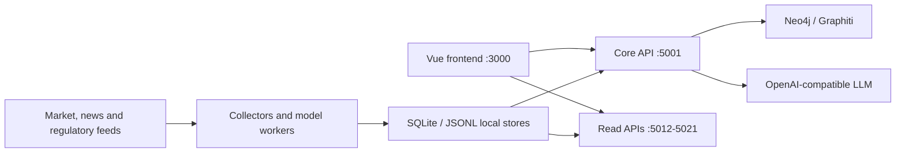

# Aquiles

Plataforma local de inteligência de mercado para pesquisa quantitativa, opções, fluxo de participantes, dados regulatórios e simulação multiagente. O Aquiles combina coletores em tempo real, modelos determinísticos, persistência histórica e uma interface Vue voltada à exploração operacional dos sinais.

> Este repositório contém integrações com provedores licenciados. Nenhuma credencial ou base operacional é distribuída. Use apenas contas e dados para os quais você possui autorização.

## Capacidades

- captura OCR residente de telas W32 e persistência intradiária;
- opções B3/OpLab, superfície de volatilidade, gregas e regimes;
- fluxo de participantes via replicador WebSocket;
- CVM CDA, N-PORT, B3, ANBIMA, ICI e CFTC para o Funds Flow;
- modelos de fair value, Markov, dependência e transmissão cross-asset;
- notícias em tempo real, classificação por LLM e contexto macro;
- grafo local Neo4j/Graphiti e simulação multiagente;
- frontend Vue com widgets de Discovery, Radar e opções.

## Arquitetura



O backend usa uma aplicação Flask principal e processos independentes para cargas com cadências e perfis de memória diferentes. Cada worker possui health check, porta própria e política de reinício no PM2. Regras de domínio ficam em `backend/app/services`; rotas apenas validam entrada, coordenam serviços e serializam respostas.

Veja [docs/architecture.md](docs/architecture.md) para limites de responsabilidade, fluxos e decisões técnicas.

## Serviços

| Processo | Porta | Responsabilidade |
| --- | ---: | --- |
| `aquiles-frontend` | 3000 | Interface Vue/Vite |
| `aquiles-backend` | 5001 | API principal, grafo e orquestração |
| `aquiles-discovery-service` | 5012 | OCR e consultas de mercado |
| `aquiles-vol-analytics-service` | 5013 | Volatilidade e índices derivados |
| `aquiles-options-model-service` | 5014 | Leitura dos modelos de opções |
| `aquiles-options-volume-tracker-service` | 5015 | Volume e atividade de opções |
| `aquiles-fair-value-markov-service` | 5016 | Regimes de Markov |
| `aquiles-cvm-cda-graph-service` | 5017 | Grafo determinístico CVM CDA |
| `aquiles-etf-daily-flow-service` | 5018 | Fluxo diário de ETFs |
| `aquiles-atemporal-chart-service` | 5019 | Séries atemporais |
| `aquiles-flow-replicator-service` | 5020 | Fluxo de participantes |
| `aquiles-options-collector-service` | 5021 | Coleta e backfill de opções |
| `aquiles-neo4j` | 7474/7687 | Grafo e memória local |

## Requisitos

- Windows 10/11 para OCR W32, Bloomberg Desktop e automação Excel;
- Node.js 24 LTS (22.12 ou superior também é suportado);
- Python 3.11;
- Java 17 e Neo4j 5 para o grafo local;
- `uv` para ambiente Python;
- credenciais próprias para os provedores habilitados.

O núcleo web também pode ser executado em Linux. Integrações Desktop são deliberadamente isoladas e permanecem exclusivas do Windows.

## Instalação

```powershell
Copy-Item .env.example .env
npm run setup:all
backend\.venv\Scripts\python.exe -m playwright install chromium
```

Preencha somente as variáveis dos módulos que serão usados. As principais são `LLM_API_KEY`, `GRAPH_BACKEND`, `NEO4J_*`, `OPLAB_ACCESS_TOKEN`, `MACRO_BLEU_WS_AUTH` e `FLOW_REPLICATOR_WS_AUTH`. O arquivo `.env` é ignorado pelo Git.

Para subir o conjunto gerenciado:

```powershell
npm run services:start
npm run services:status
```

Para desenvolvimento apenas da API e interface:

```powershell
npm run dev
```

## Qualidade

```powershell
npm run check
```

Esse comando executa Ruff e mypy no backend, ESLint e TypeScript no frontend, testes Python e JavaScript e o build de produção. A mesma sequência roda no GitHub Actions com Python 3.11 e Node 24. O pipeline aplica um piso incremental de cobertura global, preserva cobertura superior a 90% em autenticação e mantém um gate dedicado para o domínio de Funds Flow. Os pisos sobem junto com os testes até as metas de 40% global e 60% nos fluxos críticos.

A tipagem é gradual e bloqueante dentro do escopo adotado. O mypy começa em modo estrito nos módulos matemáticos extraídos; o TypeScript usa `checkJs` estrito nos contratos de autenticação, layout e formatação. Novos módulos puros devem entrar nesses escopos, e módulos legados são adicionados por domínio depois de corrigidos, sem ignorar erros no gate.

```powershell
npm run typecheck
```

O frontend possui três níveis de validação:

```powershell
npm --prefix frontend run test:unit
npm --prefix frontend run test:components
npm --prefix frontend run test:e2e
```

Os testes de componentes usam DOM isolado. As jornadas E2E usam Chromium headless e APIs simuladas para validar autenticação, redirecionamento, navegação, persistência do Discovery e logout sem depender dos microserviços locais. O GitHub Actions instala o navegador e executa as três camadas em cada push e pull request.

## Dados e segurança

- `backend/uploads`, `backend/raw`, bancos SQLite, logs e caches não pertencem ao código-fonte;
- respostas HTTP não expõem traceback ou mensagens internas de provedores;
- todas as APIs usam tokens assinados e autorização por papel (`viewer`, `operator`, `admin`);
- somente `/health` e `/api/auth/login` são públicos quando `AQUILES_AUTH_ENABLED=True`;
- logs de requisição registram metadados e `request_id`, nunca o corpo completo;
- variáveis do sistema têm precedência sobre `.env`;
- chaves publicadas anteriormente devem ser revogadas no provedor antes de tornar o repositório público.

Consulte [SECURITY.md](SECURITY.md) antes da primeira publicação.

Crie usuários sem registrar senhas em texto puro:

```powershell
python scripts/create_auth_user.py seu_usuario --roles admin
```

Coloque o JSON produzido em `AQUILES_AUTH_USERS_JSON` e mantenha
`AQUILES_AUTH_TOKEN_SECRET` somente no secret store do ambiente.

## Origem e licença

Aquiles é a identidade única do produto, da interface, dos serviços e dos artefatos operacionais deste repositório. O módulo de simulação multiagente possui origem histórica no projeto MiroFish. A atribuição completa, a ausência de vínculo atual e os componentes de terceiros estão documentados em [NOTICE.md](NOTICE.md). O projeto permanece sob AGPL-3.0; consulte [LICENSE](LICENSE).
