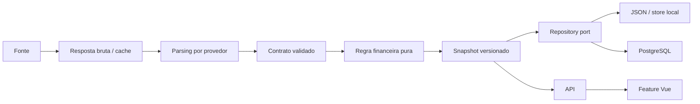

# Guia de avaliação técnica do Aquiles

Este documento é um mapa para quem precisa avaliar o projeto sem conhecer previamente
o domínio financeiro. A proposta é permitir que cada afirmação seja confirmada em
código, testes ou automação, em vez de depender apenas da descrição do autor.

## Roteiro de 15 minutos

### 1. Entenda o produto financeiro em três minutos

Abra o [README](../README.md#complexidade-financeira) e observe as três prévias de
produto. Em seguida, veja:

- [Funds Flow Local](funds-flow-local-data-graph-report.md), para entender como
  captação, resgate, patrimônio, carteira e fontes globais são cruzados;
- [modelagem quantitativa de opções](options-quant-modeling-plan.md), para conhecer
  superfície, exposição, dependência, fair value e regimes;
- [arquitetura do grafo CVM CDA](cvm-cda-graph-architecture.md), para acompanhar a
  transformação de posições regulatórias em relacionamentos navegáveis.

Pergunta de avaliação: o código modela um problema financeiro real ou apenas apresenta
gráficos? A resposta pode ser verificada nas regras puras, na linhagem das fontes e nos
contratos versionados citados nas próximas seções.

### 2. Percorra a arquitetura em cinco minutos

1. [Catálogo de domínios](../backend/app/domains/catalog.py): fonte única de ownership
   dos blueprints e prefixos HTTP.
2. [Contêiner](../backend/app/container.py): montagem explícita, criação lazy,
   substituição de dependências e separação entre API e owner de coletores.
3. [Scheduler](../backend/app/workers/collection_scheduler.py): ciclo de vida dos
   coletores fora do processo HTTP.
4. [Portas de Funds Flow](../backend/app/domains/funds_flow/application/source_ports.py):
   contratos exigidos das fontes oficiais.
5. [Adaptadores](../backend/app/domains/funds_flow/infrastructure): implementações de
   CVM, ANBIMA, B3 e ICI sem dependência reversa do domínio.
6. [Contratos Pydantic](../backend/app/domains/funds_flow/contracts/models.py): comandos,
   snapshots, status e serialização monetária.
7. [Feature Funds Flow](../frontend/src/features/funds-flow): API, componentes, modelos
   e testes agrupados pelo recurso de negócio.

O desenho esperado é borda para dentro: transporte e infraestrutura dependem das
portas internas; regras financeiras não dependem de Flask, banco ou provedor.

### 3. Valide engenharia e qualidade em sete minutos

Execute na raiz:

```powershell
npm run check
```

Depois inspecione:

- [workflow de CI](../.github/workflows/ci.yml), com lint, tipagem, testes, cobertura,
  E2E, build e auditoria de dependências;
- [quality budget](../quality-budget.toml), que transforma limites arquiteturais em
  regras bloqueantes;
- [testes de arquitetura](../backend/tests/test_domain_boundaries.py), que verificam
  ownership, direção das dependências, composição e inventário de rotas;
- [testes de propriedade](../backend/tests/test_financial_math_properties.py), que
  validam invariantes financeiros com dados gerados;
- [testes de contrato](../backend/tests/test_funds_flow_external_contracts.py), que
  congelam expectativas de integrações externas sem chamar a rede;
- [testes E2E](../frontend/e2e/aquiles-critical-journeys.spec.js), que exercitam login,
  autorização, navegação, persistência do Discovery e logout.

## Matriz de evidências

| Dimensão | O que procurar | Evidência principal | Como validar |
| --- | --- | --- | --- |
| Arquitetura | dependências direcionais e ownership | `domains/catalog.py`, `container.py`, ADRs | testes de fronteira e mypy |
| Engenharia de dados | retomada, idempotência, linhagem e cadência | adapters, repositories, collector state | testes de fontes e scheduler |
| Domínio financeiro | regras independentes de framework | `domain/rules.py`, módulos `*_math.py` | property tests e cobertura de 80% |
| Clean Code | módulos por caso de uso e contratos explícitos | `options_routes`, `simulation_routes`, features Vue | budgets de tamanho e lint |
| Escalabilidade | API sem loops e workers com owner único | scheduler, clientes remotos e PM2 | testes do container e health checks |
| Segurança | menor privilégio e segredo fora do código | `auth.py`, `.env.example`, `SECURITY.md` | 90% de cobertura de auth |
| Frontend | feature ownership e transporte isolado | `frontend/src/features` | ESLint, TypeScript, Vitest e E2E |
| Manutenção | decisões e dívida visíveis | ADRs e allowances explícitos | quality budget ratcheting |

## Engenharia de dados

### Características das fontes

O Aquiles não trata todos os provedores como se fossem uma API homogênea:

| Classe de fonte | Exemplo | Desafio de engenharia |
| --- | --- | --- |
| Tempo real | WebSockets de notícias e participantes | reconexão, heartbeat, duplicidade e ordenação |
| Desktop | OCR W32, Bloomberg e Excel | processo residente, captura incremental e isolamento Windows |
| Regulatório diário | CVM Informe Diário e CDA | publicação atrasada, backfill por data e mudança de schema |
| Institucional | ANBIMA e B3 | documentos, tabelas e classificações diferentes |
| Internacional | ICI e CFTC | frequência semanal/mensal e normalização de unidade |
| Derivativos | OpLab e B3 | vencimentos, strikes, gregas, volume e open interest |

O estado de cada coletor registra intenção de execução, última tentativa, último sucesso,
erro e checkpoint. A data econômica do dado permanece separada do horário em que ele foi
capturado. Isso é essencial para não calcular janelas financeiras com observações que
ainda não estavam disponíveis no período analisado.

### Caminho de persistência



As portas de repositório permitem trocar persistência sem alterar casos de uso. Arquivos
brutos e relatórios permanecem fora do banco relacional; Neo4j representa relações, não
substitui a fonte oficial dos valores financeiros.

## Clean Code e evolução controlada

O projeto possui legado real e não o esconde. A estratégia é impedir nova dívida e
reduzir a existente de forma mensurável:

- módulos novos têm limite padrão de 800 linhas no backend e 500 no frontend;
- módulos maiores existentes possuem allowance individual e não podem crescer;
- `type: ignore`, `noqa` e desativações do ESLint possuem tetos decrescentes;
- fachadas removidas não podem ser recriadas;
- ciclos de dependência novos são rejeitados;
- domínio importando infraestrutura falha no pipeline;
- componente Vue chamando `fetch` ou Axios diretamente falha no pipeline.

Essa política está implementada em
[`scripts/quality_budget.py`](../scripts/quality_budget.py), não apenas documentada.

## Estratégia de testes

Os 220 testes backend e 40 testes/jornadas frontend cobrem responsabilidades distintas:

1. unidades determinísticas para normalização e matemática;
2. propriedades para conservação de fluxo, períodos, probabilidades e correlações;
3. contratos para payloads de provedores e APIs;
4. aplicação para casos de uso com portas substituíveis;
5. arquitetura para dependências, ownership e tamanho;
6. componentes para comportamento visual isolado;
7. E2E para jornadas críticas no navegador.

O piso global permanece deliberadamente calculado sobre módulos legados grandes. Eles
não são retirados do denominador para produzir uma métrica artificialmente melhor.

## Pontos para discussão em entrevista

- Por que um scheduler proprietário evita coletores duplicados ao escalar a API?
- Quando JSON/SQLite deixa de ser suficiente e a porta PostgreSQL passa a ser indicada?
- Como distinguir data de captura, data de publicação e data econômica?
- Por que regras financeiras usam `Decimal`, contratos e property tests?
- Como substituir CVM ou B3 por uma fonte licenciada sem alterar o domínio?
- Como o quality budget permite modernizar um sistema grande sem uma reescrita arriscada?
- Quais workers deveriam migrar primeiro para Redis com RQ ou Dramatiq?

Essas perguntas expõem decisões e trade-offs do projeto com mais precisão do que uma
contagem bruta de arquivos ou linhas.

## Limites conhecidos

- parte dos serviços quantitativos anteriores à arquitetura por domínio ainda está em
  `backend/app/services` e é migrada verticalmente;
- nenhum arquivo permanece acima de 3.000 linhas; fachadas complexas ainda possuem
  allowances explícitos e são reduzidas por um orçamento incremental;
- integrações Desktop dependem de Windows e licenças locais;
- o piso de cobertura global por ramificações é 40% (40,75% medidos em 239 testes), com
  próxima meta incremental de 45%, enquanto autenticação, Funds Flow e matemática
  financeira já possuem gates próprios mais altos;
- Redis e execução distribuída são evoluções previstas quando houver múltiplos hosts.

Esses limites são visíveis por projeto: entram no orçamento, na documentação e na
estratégia de evolução em vez de ficarem escondidos do avaliador.
